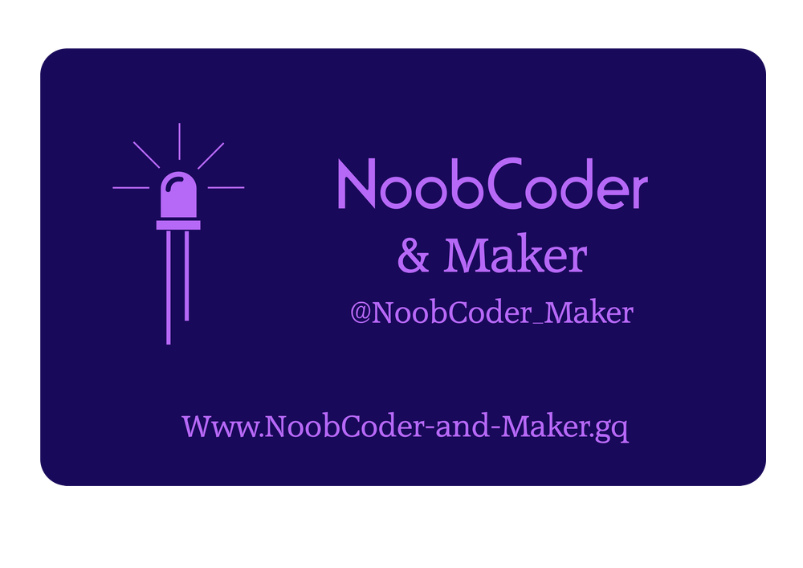
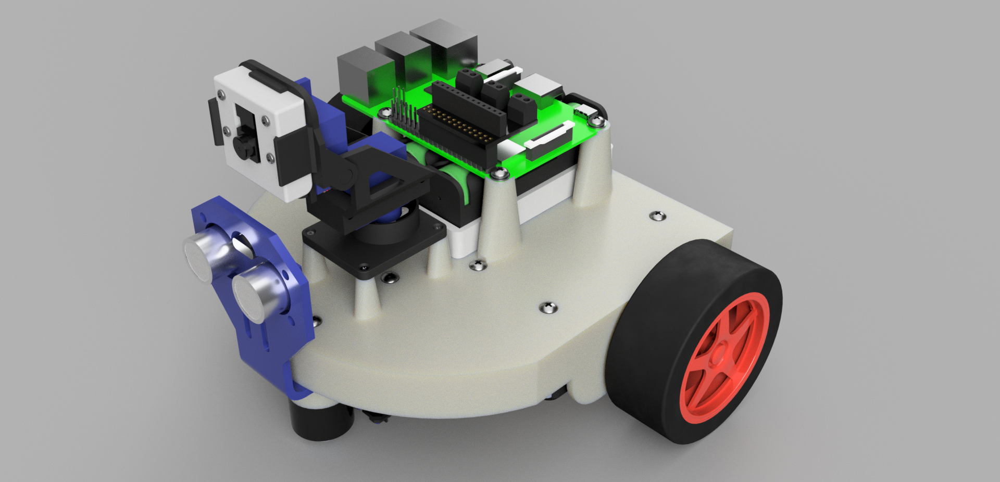

  

  
  

  <H1 align="center">CamJam-Edukit-3-Inspired-Robot</H1>
  <H2 align="center">Raspberry Pi Controlled Robot, inspired by the 'Camjam Edukit 3'</H2>

  
  <H2 align="center">Here is a link to an Autodesk Fusion 360 Live design of my robot model</H2>
  <H1 align="center"><a href="https://a360.co/2DKW5AY" target="_blank">3d LIVE View</a></H1>

This project was initially planned as a write-up of what I finished up making with the CamJam Edukit 3. For those who are not familiar with the kit, essentially it is a bunch of preselected components that allow you to create a two-wheeler robot using a Raspberry Pi, as the brains of the operation. The main selling point of the kit are the step by step instructions that are available for download and produced with associates from Cambridge University, and if these guys don’t know what they’re doing, then there’s not much hope for us, is there!
   The official CamJam instructions are in this repository, and are in folders - 

     <H3><a href="https://github.com/NoobCoder-and-Maker/CamJam-Edukit-3-Inspired-Robot/tree/master/CamJam%20Edukit%203%20-%20GPIO%20Zero" target="_blank">CamJam Edukit 3 - GPIO Zero</a>   &  
       <a href="https://github.com/NoobCoder-and-Maker/CamJam-Edukit-3-Inspired-Robot/tree/master/CamJam%20Edukit%203%20-%20RPi.GPIO" target="_blank">CamJam Edukit 3 - RPi.GPIO</a>
     </H3>

   For my robot I have decided to add additional components that are not provided with the Edukit. I will also be designing a custom 3d printed chassis to attach the components too. The design was created using Autodesk Fusion 360 design software which allows you to join components together, make adjustments to them, and create new components on the fly in its original place.

  <H2 align="center"><a href="http://noobcoder-and-maker.gq" target="_blank">Here's a blog about the project on my Wordpress website</a></H2>

